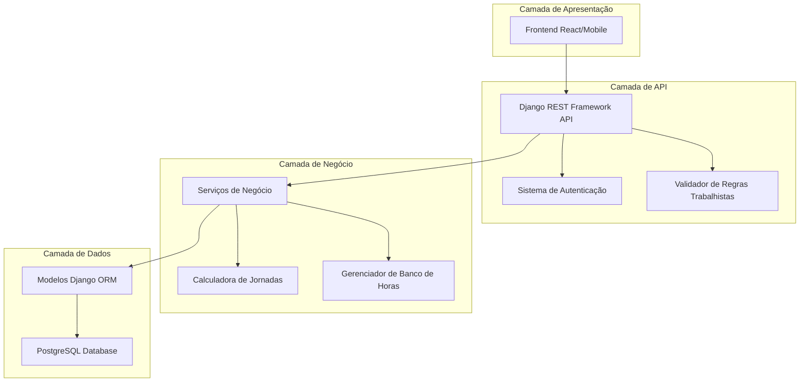
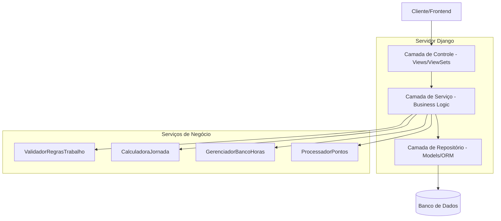
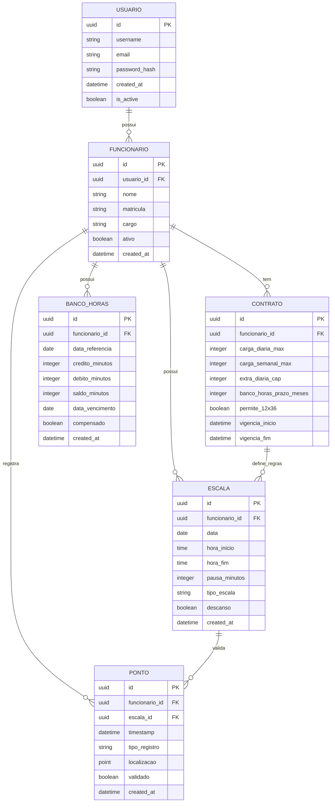

# Arquitetura Técnica - Sistema de Gerenciamento de Escalas

## 1. Design da Arquitetura



## 2. Descrição das Tecnologias

- **Frontend**: React@18 + TypeScript + TailwindCSS + Vite
- **Backend**: Django@4.2 + Django REST Framework@3.14
- **Banco de Dados**: PostgreSQL@15 (migração do SQLite atual)
- **Autenticação**: Django Authentication + JWT para API
- **Cache**: Redis para sessões e cache de consultas frequentes

## 3. Definições de Rotas

| Rota | Propósito |
|------|-----------|
| /dashboard | Dashboard principal com métricas e alertas |
| /escalas | Gestão e visualização de escalas |
| /escalas/criar | Criação de novas escalas |
| /pontos | Registro e histórico de pontos |
| /pontos/registrar | Interface de registro de ponto |
| /banco-horas | Controle de banco de horas |
| /relatorios | Relatórios e análises |
| /configuracoes | Configurações do sistema |
| /api/auth/login | Autenticação de usuários |
| /api/auth/logout | Logout de usuários |

## 4. Definições de API

### 4.1 APIs Principais

**Autenticação de usuários**
```
POST /api/auth/login
```

Request:
| Nome do Parâmetro | Tipo | Obrigatório | Descrição |
|-------------------|------|-------------|-----------|
| username | string | true | Nome de usuário ou email |
| password | string | true | Senha do usuário |

Response:
| Nome do Parâmetro | Tipo | Descrição |
|-------------------|------|-----------|
| access_token | string | Token JWT para autenticação |
| refresh_token | string | Token para renovação |
| user | object | Dados do usuário autenticado |

**Gestão de Escalas**
```
GET /api/escalas/
POST /api/escalas/
PUT /api/escalas/{id}/
DELETE /api/escalas/{id}/
```

**Registro de Pontos**
```
POST /api/pontos/registrar
GET /api/pontos/historico
```

Request (Registro):
| Nome do Parâmetro | Tipo | Obrigatório | Descrição |
|-------------------|------|-------------|-----------|
| funcionario_id | integer | true | ID do funcionário |
| tipo_registro | string | true | entrada, saida, pausa_inicio, pausa_fim |
| timestamp | datetime | true | Data e hora do registro |
| localizacao | object | false | Coordenadas GPS se aplicável |

**Banco de Horas**
```
GET /api/banco-horas/{funcionario_id}/
POST /api/banco-horas/compensar
```

**Validação de Regras**
```
POST /api/validar-jornada
```

Request:
| Nome do Parâmetro | Tipo | Obrigatório | Descrição |
|-------------------|------|-----------|-----------|
| funcionario_id | integer | true | ID do funcionário |
| data_inicio | date | true | Data de início do período |
| data_fim | date | true | Data de fim do período |

Response:
| Nome do Parâmetro | Tipo | Descrição |
|-------------------|------|-----------|
| conformidade | boolean | Se está em conformidade |
| violacoes | array | Lista de violações encontradas |
| sugestoes | array | Sugestões de correção |

## 5. Arquitetura do Servidor



## 6. Modelo de Dados

### 6.1 Definição do Modelo de Dados



### 6.2 Linguagem de Definição de Dados

**Tabela de Contratos**
```sql
-- Criar tabela de contratos
CREATE TABLE contratos (
    id UUID PRIMARY KEY DEFAULT gen_random_uuid(),
    funcionario_id UUID NOT NULL REFERENCES funcionarios(id),
    carga_diaria_max INTEGER DEFAULT 480, -- minutos
    carga_semanal_max INTEGER DEFAULT 2640, -- minutos
    extra_diaria_cap INTEGER DEFAULT 120, -- minutos
    banco_horas_prazo_meses INTEGER DEFAULT 12,
    permite_12x36 BOOLEAN DEFAULT FALSE,
    vigencia_inicio DATE NOT NULL,
    vigencia_fim DATE,
    created_at TIMESTAMP WITH TIME ZONE DEFAULT NOW(),
    updated_at TIMESTAMP WITH TIME ZONE DEFAULT NOW()
);

-- Criar índices
CREATE INDEX idx_contratos_funcionario ON contratos(funcionario_id);
CREATE INDEX idx_contratos_vigencia ON contratos(vigencia_inicio, vigencia_fim);
```

**Tabela de Escalas Expandida**
```sql
-- Expandir tabela de escalas existente
ALTER TABLE escalator_escala ADD COLUMN IF NOT EXISTS tipo_escala VARCHAR(20) DEFAULT 'normal';
ALTER TABLE escalator_escala ADD COLUMN IF NOT EXISTS pausa_minutos INTEGER DEFAULT 60;
ALTER TABLE escalator_escala ADD COLUMN IF NOT EXISTS descanso BOOLEAN DEFAULT FALSE;
ALTER TABLE escalator_escala ADD COLUMN IF NOT EXISTS hora_inicio TIME;
ALTER TABLE escalator_escala ADD COLUMN IF NOT EXISTS hora_fim TIME;

-- Criar tabela de pontos
CREATE TABLE pontos (
    id UUID PRIMARY KEY DEFAULT gen_random_uuid(),
    funcionario_id UUID NOT NULL REFERENCES escalator_funcionario(id),
    escala_id UUID REFERENCES escalator_escala(id),
    timestamp TIMESTAMP WITH TIME ZONE NOT NULL,
    tipo_registro VARCHAR(20) NOT NULL CHECK (tipo_registro IN ('entrada', 'saida', 'pausa_inicio', 'pausa_fim')),
    localizacao POINT,
    validado BOOLEAN DEFAULT FALSE,
    observacoes TEXT,
    created_at TIMESTAMP WITH TIME ZONE DEFAULT NOW()
);

-- Criar índices para pontos
CREATE INDEX idx_pontos_funcionario ON pontos(funcionario_id);
CREATE INDEX idx_pontos_timestamp ON pontos(timestamp DESC);
CREATE INDEX idx_pontos_tipo ON pontos(tipo_registro);
```

**Tabela de Banco de Horas**
```sql
-- Criar tabela de banco de horas
CREATE TABLE banco_horas (
    id UUID PRIMARY KEY DEFAULT gen_random_uuid(),
    funcionario_id UUID NOT NULL REFERENCES escalator_funcionario(id),
    data_referencia DATE NOT NULL,
    credito_minutos INTEGER DEFAULT 0,
    debito_minutos INTEGER DEFAULT 0,
    saldo_minutos INTEGER DEFAULT 0,
    data_vencimento DATE,
    compensado BOOLEAN DEFAULT FALSE,
    observacoes TEXT,
    created_at TIMESTAMP WITH TIME ZONE DEFAULT NOW(),
    updated_at TIMESTAMP WITH TIME ZONE DEFAULT NOW()
);

-- Criar índices para banco de horas
CREATE INDEX idx_banco_horas_funcionario ON banco_horas(funcionario_id);
CREATE INDEX idx_banco_horas_data ON banco_horas(data_referencia DESC);
CREATE INDEX idx_banco_horas_vencimento ON banco_horas(data_vencimento);
```

**Dados Iniciais**
```sql
-- Inserir escalas predefinidas brasileiras
INSERT INTO escalator_escalapredefinida (nome, descricao, horas_trabalho, horas_descanso) VALUES
('12x36', 'Escala hospitalar - 12 horas de trabalho por 36 de descanso', 12, 36),
('6x1', 'Escala comercial - 6 dias de trabalho por 1 de descanso', 8, 24),
('5x2', 'Escala administrativa - 5 dias de trabalho por 2 de descanso', 8, 48),
('4x2', 'Escala industrial - 4 dias de trabalho por 2 de descanso', 12, 48);

-- Inserir configurações padrão do sistema
INSERT INTO configuracoes_sistema (chave, valor, descricao) VALUES
('periodo_noturno_inicio', '22:00', 'Início do período noturno'),
('periodo_noturno_fim', '05:00', 'Fim do período noturno'),
('hora_noturna_urbana_minutos', '52.5', 'Duração da hora noturna urbana em minutos'),
('interjornada_minima_minutos', '660', 'Intervalo mínimo entre jornadas em minutos'),
('pausa_intrajornada_6h_minutos', '60', 'Pausa obrigatória para jornadas de 6h ou mais'),
('pausa_intrajornada_4h_minutos', '15', 'Pausa obrigatória para jornadas entre 4-6h');
```