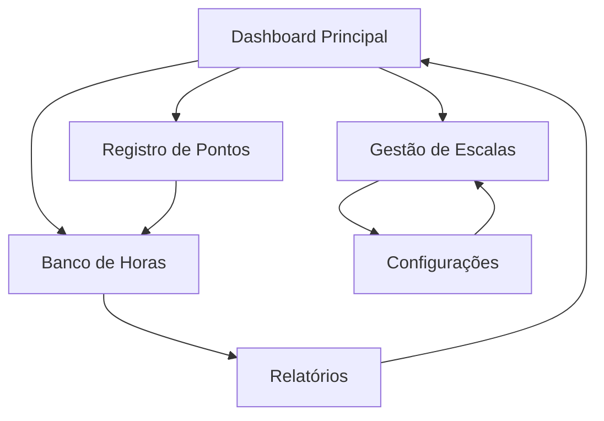

# Sistema de Gerenciamento de Escalas de Trabalho

## 1. Visão Geral do Produto

Sistema completo para gerenciamento de escalas de trabalho que automatiza o controle de jornadas, pontos e cumprimento das regras trabalhistas brasileiras. O sistema integra-se ao Django existente para fornecer controle total sobre horários, pausas, banco de horas e adicionais noturnos.

O produto resolve problemas críticos de gestão de RH: controle automatizado de jornadas, validação de regras trabalhistas e integração com sistemas de ponto eletrônico, proporcionando conformidade legal e eficiência operacional.

## 2. Funcionalidades Principais

### 2.1 Papéis de Usuário

| Papel | Método de Registro | Permissões Principais |
|-------|-------------------|----------------------|
| Funcionário | Cadastro pelo RH | Visualizar próprias escalas, registrar pontos, consultar banco de horas |
| Supervisor | Atribuição por administrador | Gerenciar escalas da equipe, aprovar horas extras, visualizar relatórios |
| Administrador RH | Acesso administrativo | Configurar contratos, definir escalas, gerenciar todos os usuários |

### 2.2 Módulos Funcionais

O sistema de escalas consiste nas seguintes páginas principais:
1. **Dashboard Principal**: visão geral de escalas, pontos pendentes, alertas de conformidade
2. **Gestão de Escalas**: criação, edição e consulta de escalas por funcionário e período
3. **Registro de Pontos**: interface para batidas de ponto com validação automática
4. **Banco de Horas**: controle de créditos/débitos, vencimentos e compensações
5. **Relatórios**: análises de jornada, horas extras, adicionais noturnos e conformidade
6. **Configurações**: parâmetros de contratos, regras personalizadas e integrações

### 2.3 Detalhes das Páginas

| Nome da Página | Nome do Módulo | Descrição da Funcionalidade |
|----------------|----------------|----------------------------|
| Dashboard Principal | Painel de Controle | Exibir resumo de escalas ativas, alertas de não conformidade, pontos pendentes e indicadores de jornada semanal |
| Gestão de Escalas | Criador de Escalas | Criar escalas individuais ou em lote, aplicar modelos predefinidos (12x36, 6x1), validar regras de interjornada e DSR |
| Registro de Pontos | Sistema de Pontos | Registrar entrada/saída/pausas, validar horários contra escala programada, calcular horas trabalhadas e extras |
| Banco de Horas | Controle de Saldos | Visualizar saldos atuais, histórico de créditos/débitos, alertas de vencimento, solicitar compensações |
| Relatórios | Análise de Dados | Gerar relatórios de jornada, horas extras, adicionais noturnos, conformidade legal e produtividade |
| Configurações | Parâmetros do Sistema | Definir cargas horárias por contrato, limites de extras, períodos noturnos, prazos de banco de horas |

## 3. Processo Principal

**Fluxo do Funcionário:**
O funcionário acessa o sistema, visualiza sua escala do dia, registra pontos de entrada/saída conforme programado, e acompanha seu banco de horas. O sistema valida automaticamente se os horários estão dentro das regras trabalhistas.

**Fluxo do Supervisor:**
O supervisor define escalas para sua equipe, aprova horas extras quando necessário, monitora conformidade através de relatórios e resolve alertas de não conformidade.

**Fluxo do Administrador:**
O administrador configura parâmetros gerais do sistema, define tipos de contrato, gerencia usuários e monitora a conformidade geral através de dashboards executivos.

## 4. Design da Interface do Usuário

### 4.1 Estilo de Design

- **Cores Primárias**: Azul corporativo (#2563eb), Verde sucesso (#16a34a)
- **Cores Secundárias**: Cinza neutro (#6b7280), Vermelho alerta (#dc2626)
- **Estilo de Botões**: Arredondados com sombra sutil, estados hover bem definidos
- **Tipografia**: Inter ou Roboto, tamanhos 14px (corpo), 18px (títulos), 24px (cabeçalhos)
- **Layout**: Design baseado em cards com navegação lateral fixa
- **Ícones**: Lucide React ou Heroicons para consistência visual

### 4.2 Visão Geral do Design das Páginas

| Nome da Página | Nome do Módulo | Elementos da UI |
|----------------|----------------|-----------------|
| Dashboard Principal | Painel de Controle | Cards de métricas, gráficos de barras para jornada semanal, lista de alertas com badges coloridos, calendário compacto |
| Gestão de Escalas | Criador de Escalas | Calendário interativo, formulários modais, tabelas responsivas, filtros por período/funcionário |
| Registro de Pontos | Sistema de Pontos | Botões grandes para entrada/saída, cronômetro visual, histórico em timeline, validações em tempo real |
| Banco de Horas | Controle de Saldos | Medidores de progresso para saldos, tabelas com paginação, alertas de vencimento destacados |
| Relatórios | Análise de Dados | Gráficos interativos (Chart.js), filtros avançados, exportação PDF/Excel, visualizações responsivas |
| Configurações | Parâmetros do Sistema | Formulários organizados em abas, toggles para ativação de regras, campos numéricos com validação |

### 4.3 Responsividade

O sistema é desenvolvido com abordagem mobile-first, garantindo usabilidade completa em dispositivos móveis para registro de pontos em campo. A interface adapta-se automaticamente para tablets e desktops, mantendo funcionalidade completa em todas as resoluções.